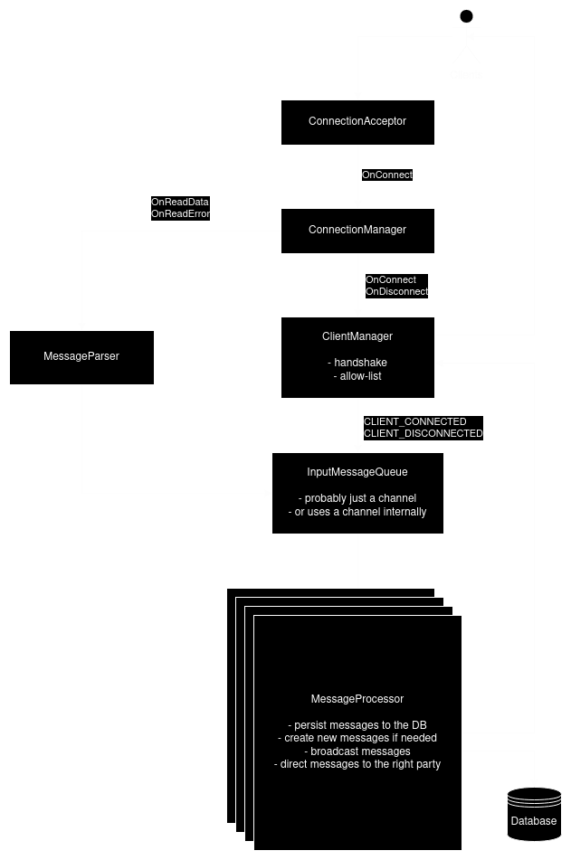

# chat-server

This repository defines a chat server using TCP connections to communicate with users.

# Badges

[](https://github.com/Knoblauchpilze/chat-server/actions/workflows/build-and-push.yml)

[](https://codecov.io/gh/Knoblauchpilze/chat-server)

# Installation

## Prerequisites

This project requires the following tools to be installed on your machine:

- [go](https://go.dev/doc/install)
- [postgresql](https://www.postgresql.org/download/linux/ubuntu/)
- [docker](https://docs.docker.com/engine/install/ubuntu/) (in case you want to build the Docker image locally)

## Setup the repository

Once the tools above are available, you can clone the repository as so:

```bash
git clone git@github.com:Knoblauchpilze/chat-server.git
```

## General structure of the project

This project defines a single application to be run available under [cmd/chat-server](cmd/chat-server/). The server uses configuration files (see e.g. [config-template-dev.yml](cmd/chat-server/configs/config-template-dev.yml)) to configure various aspects of the application.

The `chat-server` folder provides a [Makefile](cmd/chat-server/Makefile) with useful targets:

- `setup` should be run when setting up the repository: it will copy the template configuration files to local (ignored by `git`) versions
- `run` will build and run the server application

## Configuring the database

The server uses a database to store users, rooms and messages. It is defined under the [database/chats](database/chats) repository. The database requires 3 different passwords to be defined: this is explained in a bit more detailed in the [galactic-sovereign](https://github.com/Knoblauchpilze/galactic-sovereign?tab=readme-ov-file#creating-the-database) project.

As a summary, in order to setup the database you can run the following commands:

```bash
cd database

export ADMIN_PASSWORD='my-admin-password'
export MANAGER_PASSWORD='my-manager-password'
export USER_PASSWORD='my-user-password'

./create_user.sh chats
./create_database.sh chats
cd chats
make migrate
```

The migrations already include a data seeding step to fill the database with a couple of users and rooms so that you can directly interact with the server.

# How does this work?

## Generalities

This project defines a server allowing users to connect to various rooms and chat with other registered users in private rooms (i.e. accessible only to two users). The chat server offers persistent storage of messages in the form of a chat history.

Chat rooms can be created by users and should have a unique name. A user is free to join a room or leave it.

## Technology overview

There are multiple ways to implement a chat server. Common practices include:

- using TCP sockets
- using websockets
- using SSE

Each solution has advantages and drawbacks. During the research phase, some projects stood out:

- [go-random-chat](https://github.com/minghsu0107/go-random-chat), a fully scalable chat app with backend and frontend relying on websockets
- [gorilla chat example](https://github.com/gorilla/websocket/tree/main/examples/chat), using websockets
- [coder/websocket chat example](https://github.com/coder/websocket/blob/master/internal/examples/chat/chat.go), also relying on websockets

Initially we also explored having a chat using raw TCP sockets (see removal commit [885d53f](https://github.com/Knoblauchpilze/chat-server/commit/885d53fd49c0afcf6d868fa9eba494b4eca79202)).

The current implementation uses [Server-Sent Events](https://developer.mozilla.org/en-US/docs/Web/API/Server-sent_events/Using_server-sent_events) to handle the publishing of messages to the client.

This comes from a reasoning that:

- websockets are not [super widely adopted](https://stackoverflow.com/questions/28582935/does-http-2-make-websockets-obsolete) and (as for everything) it seems they are a bit clunky
- they don't cleanly support authentication although some [hacky ways exist](https://stackoverflow.com/questions/4361173/http-headers-in-websockets-client-api) around it
- it was generally a pain to make it work in the browser, especially after the move from raw TCP sockets

For all these reasons we decided to go for SSE.

The approach is similar to what is done in the [websocket example](https://github.com/coder/websocket/blob/master/internal/examples/chat/chat.go#L114) of `coder/websocket`. The idea is that each client needs to subscribe to receive updates and uses a regular HTTP endpoint to post new messages.

In order to decouple message processing and publishing and allow scalability, the server defines an internal message bus which handles:

- saving messages to the database
- pushing messages to connected clients

This might allow to use a message driven architecture in the future?

Messages, rooms and concepts of the server are saved in a database to guarantee the persistence of the data.

## Receiving messages

To receive update and messages, clients needs to perform a `GET` request at `/v1/chats/users/:id/subscribe`. This connection will use SSE to send updates in a format looking like so:

```
id: 8f102c70-8eba-4094-bd4d-7f70d71b21f2
data: {"id":"8f102c70-8eba-4094-bd4d-7f70d71b21f2","user":"f2d9ce22-179d-431c-b63d-43d5a8ab5e18","room":"111838db-a871-47be-9149-c974fd356316","message":"Hello","created_at":"2025-05-04T20:56:16Z"}

id: c67d411c-e62d-4e2b-8008-415028538ee6
data: {"id":"c67d411c-e62d-4e2b-8008-415028538ee6","user":"3322ed83-cce4-49da-a1cb-2219990af50c","room":"111838db-a871-47be-9149-c974fd356316","message":"Hello back","created_at":"2025-05-04T20:57:16Z"}

...
```

The messages are formatted in a JSON format and respect the syntax expected for such events. We used heavily what is provided in the [echo documentation](https://echo.labstack.com/docs/cookbook/sse) about SSE to implement the logic in this project.

The user should only receive messages that are relevant to them: no messages for rooms that they don't belong to should be transmitted.

## Posting new messages

For a chat server it might be beneficial to use websockets to send messages: the idea is that it can be a relatively frequent operation and it might be nice to not reopen a connection each time.

In this project we threw those concerns away and just provided a HTTP endpoint to post a message: `v1/chats/rooms/:id/messages`. It is expected to provided a body containing the message to create.

The response will be (if everything goes well) `202` (Accetped) to indicate that the message has been taken into consideration by the server and will be processed later on. As we have an asynchronous process we don't create it immediately in the database but rather post it to the internal message bus.

In the future, this might be posted to a message broker (such as Kafka).

## Connection lifecycle

The `POST` requests to send messages are only lasting the time it takes for the server to read the message's body and close the connection.

It is different for the `GET` request to subscribe to updates. This connection typically stays open for the duration of the chat session and will be used to send messages update to the client.

We currently don't have a ping/pong mechanism but this would be a good addition to make sure that we don't keep stale connections.

## Processing of messages

The diagram below presents the architecture of the server and how it handles messages.



ℹ️ the diagram above is best seen with dark theme.

The clients need to establish two connections:

- a long-lasting `GET` connection to the `subscribe` endpoint to receive updates
- ephemeral `POST` connections to publish messages to the server

The `MessageService` has the responbility to validate messages and publish them to the internal message processor. This is currently represented by a channel but could be made more scalable by using a message bus.

The `Manager` is notified whenever a client establishes a new subscribe request and keeps track of the connected clients to a specific pod (in the current state, always 1). This would allow to scale in the future. It is also notified by the `MessageProcessor` of incoming messages. This could be achieved by using a message broker such as Kafka.

Finally the `Client` is a little convenience structure which also contains a buffer of messages to send to the client. It handles:

- formatting messages in a way compatible with SSE syntax
- regularly ping the client to make sure it's still alive
  Hopefully it can keep up with the amount of messages to send even for slow clients. In case it can't we could implement a mechanism to terminate slow clients.

# Ideas

- Deactivate rooms if nobody is in them anymore
- Handle private/public rooms
- Do not allow users to leave private rooms (or delete them)
- Implement invitation to a room
- Login and logout system
- Distributed architecture through a message broker
- Read/unread messages
- User-123-has-come-online type notifications
- Allow/disallow lists (e.g. ban)
