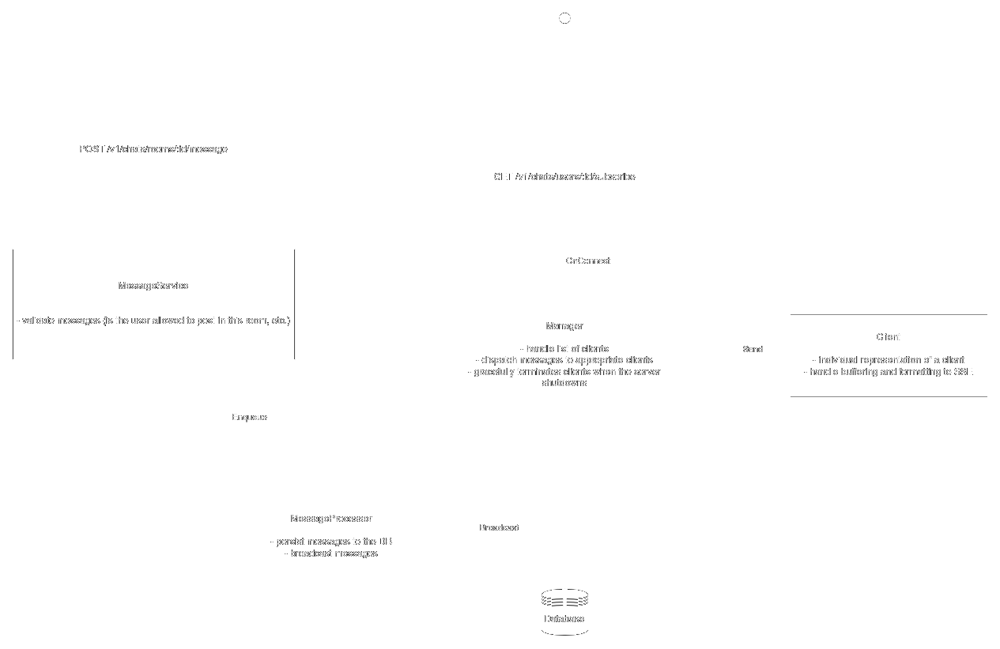

# chat-server

This repository defines a chat server using TCP connections to communicate with users.

# Badges

# How does this work?

## Generalities

This project defines a server allowing users to connect to various rooms and chat with other registered users in private rooms (i.e. accessible only to two users). The chat server offers persistent storage of messages in the form of a chat history.

Chat rooms can be created by users and should have a unique name. A user is free to join a room or leave it.

## Technology overview

The chat server uses persistent TCP connections to receive messages from users and send them messages concerning them. The connection can either be closed by the user (which the server detects) or by the server in case the user misbehave.

Messages, rooms and concepts of the server are saved in a database to guarantee the persistence of the data.

## The TCP server

A very interesting [tutorial](https://eli.thegreenplace.net/2020/graceful-shutdown-of-a-tcp-server-in-go/) about how to make TCP servers able to gracefully shutdown.

The general idea is that the server is listening on a specific port to which clients can connect to. As soon as a connection is established, some callbacks are triggered to know if the user should be denied or granted the connection.

The connection stays open for the duration of the session and is used as a bidirectional communication channel between the server and the user.

## Connection lifecycle

When a connection has been accepted, the server listens to events happening on it. This typically includes:

- data received from the user.
- disconnection.

On top of this there are internal events that will produce data to send through the connection. This mainly includes messages for rooms that the user belongs to or direct messages from other users.

## Processing of messages

The diagram below presents the architecture of the server and how it handles messages.

# Ideas

- Deactivate rooms if nobody is in them anymore.
- Handle private/public rooms.
- Do not allow users to leave private rooms (or delete them).
- Implement invitation to a room.
- Login and logout system.
